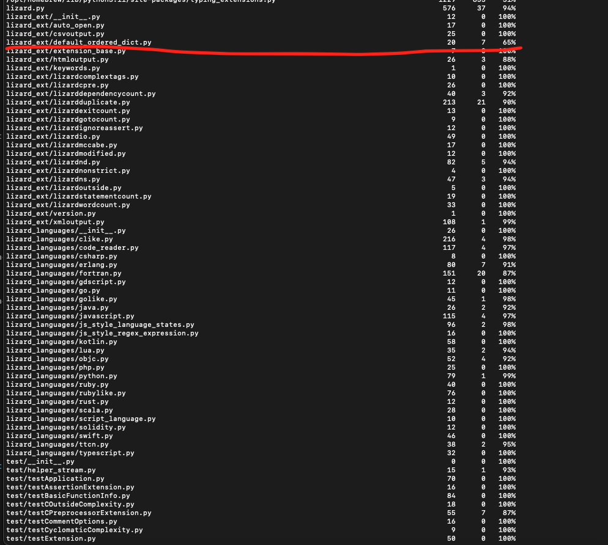
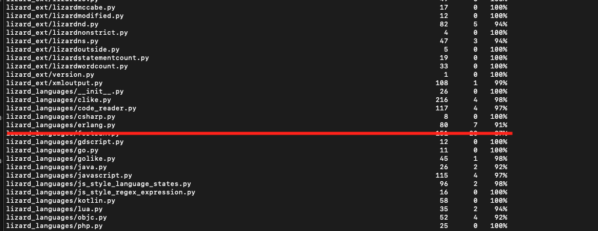

# Report for Assignment 1

## Project chosen

Name: Lizard

URL: https://github.com/terryyin/lizard 

Number of lines of code and the tool used to count it: 57603 counted with lizard.py (same Github link)

Programming language: Python

## Coverage measurement

### Existing tool

We used coverage.py and entered the following command in the main directory of lizard: coverage run -m pytest test
this gave the following output:

next we constructed the report by doing 'coverage report' and we downloaded this with 'coverage html'. the test also included some python packages that we ignored for this assigment and exluded them in the screenshots. the following two images are the result of 'coverage report' inside the terminal:

### Your own coverage tool

## Daniel Buis

the first function I chose was the DefaultOrderedDict class from default_ordered_dict.py in the lizard_ext directory based on its current coverage and complexity. (coverage of 65%)

this is a link to a commit made in our forked repository that shows the instrumented code to gather coverage measurements: https://github.com/terryyin/lizard/commit/e929da5bf9a278d485483d1905e6c05b8c72b877

this is the output of the instrumentation after running the tests:

the second function I chose was the_state_nested_end from erlangt.py in the lizard_languages directory based on its current coverage and complexity. (coverage of 91%)

this is a link to a commit made in our forked repository that shows the instrumented code to gather coverage measurements: https://github.com/Djaro08/lizard-SEP/commit/7d847957c796bfa690bd6a188ed77018fc7bfa5c

this is the output of the instrumentation after running the tests:

## Kristóf Földházi

<Function 1 name>

<Show a patch (diff) or a link to a commit made in your forked repository that shows the instrumented code to gather coverage measurements>

<Provide a screenshot of the coverage results output by the instrumentation>

<Function 2 name>

<Provide the same kind of information provided for Function 1>

## Darian de Graaf

I chose to measure the coverage from 2 functions in fortran.py in the lizard languages directory.
The first function I chose to measure the coverage on is _state_global and the second function is _ignore_if_paren. Neither of these functions were fully covered by the original tests.

In this commit you can see the code i added to measure the coverage of these functions. https://github.com/terryyin/lizard/commit/1c4e0a83567b86584c5368737235e8bd6cf90a59

In this screenshot you can see the coverage results of these changes resulting in a coverage of 44% over these 2 functions and a total coverage of 87% on this file as shown in the screenshots in the existing tool section.

## Coverage improvement

### Individual tests

## Daniel Buis

Test 1:
this is a link to a commit made in our forked repository that shows the new/enhanced test:
https://github.com/Djaro08/lizard-SEP/commit/a58cae72cf51eb2ba055c82d7257a8bd9ea67614

The old coverage results:

The new coverage results:

test_default_ordered_dict_with_default_factory:
This test creates an instance of DefaultOrderedDict with int as the default_factory.
It then tries to access a missing key, which should trigger the __missing__ method and use the default_factory to set the default value.

test_default_ordered_dict_without_default_factory:
This test creates an instance of DefaultOrderedDict without a default_factory.
It then tries to access a missing key, which should trigger the __missing__ method and raise a KeyError.

test_reduce_with_default_factory:
This test creates an instance of DefaultOrderedDict with int as the default_factory.
It calls the __reduce__ method, which should return a tuple representing the instance.

test_reduce_without_default_factory
This test creates an instance of DefaultOrderedDict without a default_factory.
It calls the __reduce__ method, which should return a tuple representing the instance.

Test 2:
this is a link to a commit made in our forked repository that shows the new/enhanced test: https://github.com/Djaro08/lizard-SEP/commit/553aac6e687264a60e018636fb67b5c373bb4ab2 

The old coverage results:

The new coverage results:

test_state_nested_end_with_dot:
This test sets up the state machine to be in _state_nested_end. It pushes a function named 'fun' onto the stack. It then feeds the '.' token to the state machine.
The presence of 'fun' in the stack should trigger the nested end condition, calling self.statemachine_return() and then transitioning to _state_global.
This covers the condition if token == '.' or token == ',' and checks the inner condition if len(self.context.stacked_functions) > 1 and self.context.stacked_functions[-1].name == 'fun'.

## Kristóf Földházi

<Test 1>

<Show a patch (diff) or a link to a commit made in your forked repository that shows the new/enhanced test>

<Provide a screenshot of the old coverage results (the same as you already showed above)>

<Provide a screenshot of the new coverage results>

<State the coverage improvement with a number and elaborate on why the coverage is improved>

<Test 2>

<Provide the same kind of information provided for Test 1>

## Darian de Graaf

<Test 1>
The first test i made is called test_new_block. In the following commit you can see the test from line 62-82.
https://github.com/terryyin/lizard/commit/762b627af59d9cf2ae9b288f29c4d05f8bae8172

The old coverage results

The new coverage results

Before the coverage was 87% on the fortran.py file and after the first new test the coverage is improved to 89%.
This happened because the 2 functions mentioned earlier in the personal tool measurement _state_global and _ignore_if_paren had a total of 3 extra branches covered.
One branch in _state_global for the BLOCK token and both branches in the _ignore_if_paren function are covered by this test.

<Test 2>
The second test i made is called test_program. In the following commit you can see the new test from line 69-86
https://github.com/terryyin/lizard/commit/18f006521925030094da6b0c6d30bfcf9976146d

The old coverage results

The new coverage results

Before the second new test the coverage was 89% as stated above and after the second new test the coverage is improved to 91%.
The new test covers one branch in the _state_global function, namely the PROGRAM branch, and tests if this branch is properly executed.

### Overall

This is a screenshot of the old coverage results, we retrieved by running an existing tool (the same as we already showed above)

<Provide a screenshot of the new coverage results by running the existing tool using all test modifications made by the group>

## Statement of individual contributions

<Write what each group member did>
