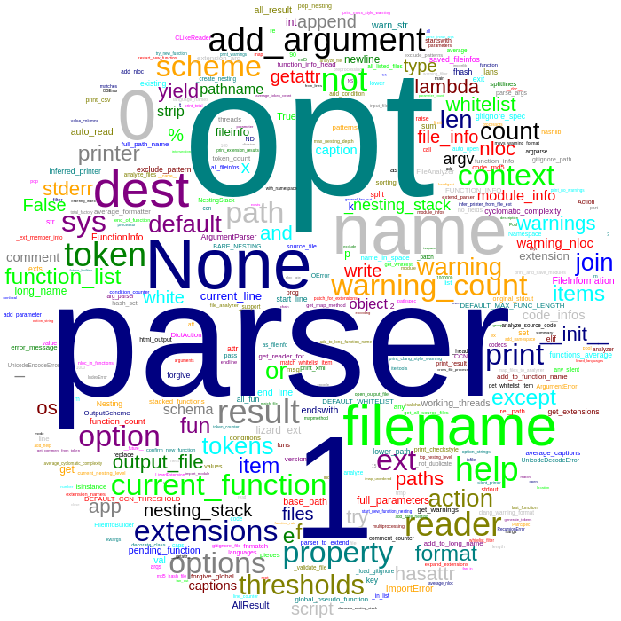
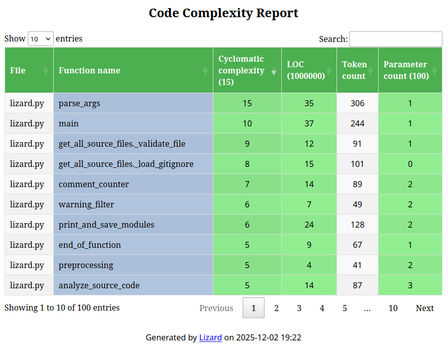

# Lizard Extensions Documentation

## Table of Contents
- [Overview](#overview)
- [Metric Extensions](#metric-extensions)
- [Analysis Extensions](#analysis-extensions)
- [Behavior Modifiers](#behavior-modifiers)
- [Output Formatters](#output-formatters)
- [Usage Examples](#usage-examples)
- [Combining Extensions](#combining-extensions)
- [CI/CD Integration](#cicd-integration)

## Overview

Lizard supports a powerful extension system that allows you to customize analysis, add additional metrics, modify behavior, and format output in various ways. Extensions are activated using the `-E` flag followed by the extension name (e.g., `-Eduplicate`) or specific command-line flags for certain extensions.

## Metric Extensions

### Nesting Depth (ND)
**File:** `lizardnd.py`
**Flag:** `-N` or `--ND`
**Default Threshold:** 7

Measures the maximum nesting depth of control structures (if, for, while, etc.) within functions. High nesting depth can indicate complex, hard-to-understand code.

**Example:**
```bash
lizard --ND 5 your_code/
```

**Output (from lizard codebase):**
```
================================================
  NLOC    CCN   token  PARAM  length  location
------------------------------------------------
     155      2    580      1     164 arg_parser@89-252@lizard.py
...
```

### Nested Structures (NS)
**File:** `lizardns.py`
**Flag:** `-ENS` with `--NS` threshold
**Default Threshold:** 3

Counts the number of nested control structures within a function. Unlike nesting depth which measures how deep, this counts how many structures are nested.

**Example:**
```bash
lizard -ENS --NS 2 your_code/
```

**Output (from lizard codebase):**
```
======================================================
  NLOC    CCN   token  PARAM  length   NS   location
------------------------------------------------------
       8      4     61      3       8     7 analyze_files@66-73@lizard.py
       5      2     70      5       5     8 arg_parser.__call__@96-100@lizard.py
     155      2    580      1     164     9 arg_parser@89-252@lizard.py
...
```

The NS column shows the maximum nested structures count for each function.

### McCabe Complexity
**File:** `lizardmccabe.py`
**Flag:** `-Emccabe`

Adjusts the cyclomatic complexity calculation according to McCabe's definition. In this mode, fall-through cases in switch/case statements don't add to complexity - only the first case counts.

**Use Case:** When you want stricter adherence to McCabe's original complexity definition.

### Statement Count
**File:** `lizardstatementcount.py`
**Flag:** `-Estatementcount`

Counts the number of statements in functions (C/C++ family languages only). Includes semicolons, control structures (if, for, while), and block statements.

**Use Case:** Understanding code density and verbosity.

### Exit Count
**File:** `lizardexitcount.py`
**Flag:** `-Eexitcount`

Counts the number of exit points (return statements) in each function. The first return is counted as 1.

**Use Case:** Identifying functions with multiple exit points that may be harder to reason about.

### Goto Count
**File:** `lizardgotocount.py`
**Flag:** `-Egotocount`

Counts goto statements in your code.

**Use Case:** Code quality audits to identify and reduce goto usage.

### Boolean Expression Count
**File:** `lizardboolcount.py`
**Flag:** `-Eboolcount`

Counts boolean expressions and operators in functions.

**Use Case:** Understanding logical complexity beyond standard CCN.

### Word Frequency / Tag Cloud
**File:** `lizardwordcount.py`
**Flag:** `-EWordCount`

Analyzes identifier frequency across your codebase and generates an HTML tag cloud visualization. Outputs to `codecloud.html`.

**Example:**
```bash
lizard -EWordCount your_code/
```

This will:
1. Count all identifiers in your code (ignoring comments and strings)
2. Generate an HTML file (`codecloud.html`) with an interactive tag cloud
3. Automatically open it in your browser


*Example word cloud generated from the lizard codebase*

**Sample Output** (from lizard.py analysis):
The generated HTML contains an interactive 700x700px canvas with colored words sized by frequency:
- Most common: `opt` (35), `parser` (35), `1` (34), `None` (31)
- High frequency: `name` (29), `filename` (25), `reader` (21), `token` (21)
- Medium frequency: `current_function` (20), `extensions` (19), `options` (19)

The visualization displays words in various colors (aqua, black, blue, fuchsia, gray, green, lime, maroon, navy, olive, orange, purple, red, silver, teal) with font sizes proportional to their occurrence frequency. Words are arranged in an elliptical pattern with larger, more frequent words positioned centrally.

**What the HTML looks like:**
The generated file creates an interactive canvas visualization where:
- Larger text = more frequently used identifier
- Random colors for visual distinction
- Elliptical layout prevents edge overcrowding
- Top 400 most common identifiers are displayed
- Fully self-contained HTML (no external dependencies)

**Use Case:**
- Visualizing naming patterns and conventions
- Identifying overused or generic variable names
- Understanding domain vocabulary at a glance
- Code review: spotting naming inconsistencies
- Presentations: visual overview of codebase structure

**To see it yourself:**
```bash
cd /path/to/your/project
lizard -EWordCount .
# Opens codecloud.html in your browser automatically
```

You can also take a screenshot of the generated visualization for documentation or reports.

### Dependency Count
**File:** `lizarddependencycount.py`
**Flag:** `-Edependencycount`

Analyzes and counts dependencies in your code.

## Analysis Extensions

### Code Duplication Detection
**File:** `lizardduplicate.py`
**Flag:** `-Eduplicate`

Detects duplicate code blocks across your codebase. Uses token-based comparison with variable name normalization to find structural duplicates.

**Example:**
```bash
lizard -Eduplicate your_code/
```

**Output Format:**
```
Duplicates
===================================
Duplicate block:
--------------------------
file1.py:45 ~ 67
file2.py:123 ~ 145
^^^^^^^^^^^^^^^^^^^^^^^^^^

Total duplicate rate: 12.50%
Total unique rate: 45.30%
```

**Use Case:**
- Identifying copy-paste code
- Refactoring opportunities
- Code quality audits

### Duplicated Parameter Lists
**File:** `lizardduplicated_param_list.py`
**Flag:** `-Eduplicatedparamlist`

Finds functions with identical or very similar parameter lists, which might indicate missing abstractions.

### Complex Tags Analysis
**File:** `lizardcomplextags.py`
**Flag:** `-Ecomplextags`

Analyzes complex code patterns and tags.

### Comment Extraction
**File:** `lizarddumpcomments.py`
**Flag:** `-Edumpcomments`

Extracts all comments from source code.

**Use Case:** Documentation analysis, comment coverage statistics.

## Behavior Modifiers

### Ignore Assert
**File:** `lizardignoreassert.py`
**Flag:** `-EIgnoreAssert`

Excludes complexity within `assert()` and `static_assert()` statements from CCN calculations. Subtracts logical operators (`&&`, `||`, `?`) found in assertions.

**Example:**
```bash
lizard -EIgnoreAssert your_code/
```

**Use Case:** When assertions are considered tests rather than logic, reducing their impact on complexity metrics.

### Modified CCN
**File:** `lizardmodified.py`
**Flag:** `-m` or `--modified`

Calculates modified cyclomatic complexity where an entire switch/case block counts as 1 complexity instead of N+1 (where N is the number of cases).

**Example:**
```bash
lizard -m your_code/
```

**Difference:**
- Standard: `switch` = +1, each `case` = +1 → Total = N+1
- Modified: `switch` = +1, each `case` = -1 → Total = 1

**Use Case:** When switch statements are viewed as a single logical decision.

### Include Global Code
**File:** `lizardoutside.py`
**Flag:** `-Eoutside`

Includes global code (code outside functions) as a pseudo-function called `*global*` in the analysis.

**Example:**
```bash
lizard -Eoutside lizard.py
```

**Output:**
```
     149      7    494      0    1123 *global*@0-1122@lizard.py
```

**Use Case:**
- Analyzing module-level initialization code
- Understanding global scope complexity
- Enforcing limits on global code

### C Preprocessor Handling
**File:** `lizardcpre.py`
**Flag:** `-Ecpre`

Ignores code between `#else` and `#endif` directives in C/C++ preprocessor conditionals.

**Example:**
```bash
lizard -Ecpre your_c_code/
```

**Use Case:**
- Analyzing only the primary code path
- Simplifying analysis of heavily preprocessor-dependent code
- Platform-specific code analysis

### Non-Strict Mode
**File:** `lizardnonstrict.py`
**Flag:** `-Enonstrict`

Enables non-strict parsing mode for more lenient code analysis.

### Fan-in/Fan-out Analysis
**File:** `lizardio.py`
**Flag:** `-Eio`

Calculates structural fan-in and fan-out metrics for functions:
- **fan_in**: Number of other functions that call this function
- **fan_out**: Number of other functions called within this function (local scope)
- **general_fan_out**: Total number of function calls in the global scope

**Use Case:**
- Identifying highly coupled functions
- Finding functions that are called frequently (high fan-in may indicate key utilities)
- Detecting functions that call many others (high fan-out may indicate coordination/orchestration functions)
- Refactoring candidates for better modularity

## Output Formatters

### CSV Output
**File:** `csvoutput.py`
**Flag:** `--csv`

Generates machine-readable CSV output with detailed metrics for each function.

**Example:**
```bash
lizard --csv -V your_code/ > report.csv
```

**Output Format:**
```csv
NLOC,CCN,token,PARAM,length,location,file,function,long_name,start,end
5,2,47,5,9,"analyze@55-63@lizard.py","lizard.py","analyze","analyze( paths , exclude_pattern = None , threads = 1 , exts = None , lans = None )",55,63
8,4,61,3,8,"analyze_files@66-73@lizard.py","lizard.py","analyze_files","analyze_files( files , threads = 1 , exts = None )",66,73
```

**Features:**
- Includes file name, function name, line numbers
- Full function signatures in `long_name`
- Easy to import into spreadsheets, databases
- No summary sections, just raw data
- Works with extension metrics (adds extra columns)

**Use Case:**
- Data analysis with pandas/Excel
- Automated reporting pipelines
- Integration with custom tools

### HTML Output
**File:** `htmloutput.py`
**Flag:** `-H` or `--html`

Generates an interactive HTML report with DataTables for sorting, searching, and filtering.

**Example:**
```bash
lizard -H -o report.html your_code/
```


*Interactive HTML report with sortable columns and filtering*

**Features:**
- Sortable columns (click headers)
- Search/filter functionality
- Pagination for large datasets
- Color-coded threshold violations
  - Green: Below threshold
  - Red: Above threshold
- Responsive design
- Works offline (loads jQuery/DataTables from CDN)

**Note:** Requires jinja2: `pip install jinja2`

**Use Case:**
- Human-readable reports
- Team code reviews
- Management dashboards
- Archiving analysis results

### XML Output (cppncss format)
**File:** `xmloutput.py`
**Flag:** `-X` or `--xml`

Generates XML output compatible with cppncss format, designed for Jenkins integration.

**Example:**
```bash
lizard -X your_code/ > lizard_report.xml
```

**Output Format:**
```xml
<?xml version="1.0" ?>
<?xml-stylesheet type="text/xsl" href="https://raw.githubusercontent.com/terryyin/lizard/master/lizard.xsl"?>
<cppncss>
	<measure type="Function">
		<labels>
			<label>Nr.</label>
			<label>NCSS</label>
			<label>CCN</label>
		</labels>
		<item name="analyze(...) at lizard.py:55">
			<value>1</value>
			<value>5</value>
			<value>2</value>
		</item>
		...
	</measure>
	<measure type="File">
		...
	</measure>
</cppncss>
```

**Use Case:**
- Jenkins CI/CD integration
- XML processing pipelines
- Historical tracking with XML databases

### Checkstyle Output
**File:** `checkstyleoutput.py`
**Flag:** `--checkstyle`

Generates Checkstyle-compatible XML output for CI/CD tool integration.

**Example:**
```bash
lizard --checkstyle your_code/ > checkstyle_report.xml
```

**Use Case:**
- Integration with Checkstyle-aware tools
- SonarQube integration
- IDE integration (many IDEs support Checkstyle format)
- Unified violation reporting with other Checkstyle rules

## Usage Examples

### Finding Complex Functions
```bash
# Find functions with CCN > 10
lizard -C 10 -w your_code/

# Find deeply nested functions (ND > 4)
lizard --ND 4 your_code/
```

### Duplicate Code Analysis
```bash
# Find all duplicates
lizard -Eduplicate your_code/

# Combine with specific file patterns
lizard -Eduplicate your_code/ -x "*/tests/*"
```

### Comprehensive Analysis
```bash
# Multiple metrics at once
lizard -ENS --NS 2 -C 15 --ND 5 your_code/
```

### Generating Reports
```bash
# HTML report with all metrics
lizard -H -ENS -Eoutside -o report.html your_code/

# CSV for data analysis
lizard --csv -V -ENS your_code/ > metrics.csv

# XML for Jenkins
lizard -X your_code/ > build/lizard_report.xml
```

### Code Quality Audit
```bash
# Analyze with multiple behavior modifiers
lizard -m -EIgnoreAssert -Eoutside your_code/

# Generate word cloud to understand vocabulary
lizard -EWordCount your_code/
```

## Combining Extensions

Extensions can be combined for powerful analysis:

```bash
# Comprehensive quality check
lizard -ENS --NS 2 -Eduplicate -Eoutside -H -o full_report.html your_code/

# CI/CD-ready with multiple outputs
lizard -ENS -C 15 --ND 5 --csv -o metrics.csv your_code/
lizard -ENS -X -o jenkins_report.xml your_code/

# Modified complexity with nesting analysis
lizard -m -ENS --NS 3 your_code/
```

## CI/CD Integration

### Jenkins Integration

**Jenkinsfile example:**
```groovy
stage('Code Complexity Analysis') {
    steps {
        sh 'lizard -X src/ > lizard_report.xml'
        publishCppcheck pattern: 'lizard_report.xml'
    }
}
```

### GitHub Actions

**workflow.yml example:**
```yaml
- name: Run Lizard Analysis
  run: |
    pip install lizard
    lizard --csv -V src/ > lizard_metrics.csv
    lizard -X src/ > lizard_report.xml

- name: Upload Metrics
  uses: actions/upload-artifact@v3
  with:
    name: complexity-metrics
    path: |
      lizard_metrics.csv
      lizard_report.xml
```

### GitLab CI

**.gitlab-ci.yml example:**
```yaml
complexity_analysis:
  stage: test
  script:
    - pip install lizard
    - lizard --checkstyle src/ > checkstyle_report.xml
    - lizard -H -o complexity_report.html src/
  artifacts:
    reports:
      codequality: checkstyle_report.xml
    paths:
      - complexity_report.html
```

### Failing Builds on Thresholds

```bash
# Exit with error if any function exceeds thresholds
lizard -C 15 --ND 5 -w your_code/

# Count warnings and fail if too many
lizard -i 10 your_code/  # Fail if more than 10 warnings
```

### Pre-commit Hook

**`pre-commit-config.yaml`:**
```yaml
- repo: local
  hooks:
    - id: lizard
      name: Lizard Complexity Check
      entry: lizard
      language: python
      args: ['-C', '15', '--ND', '5', '-w']
      pass_filenames: false
      additional_dependencies: ['lizard']
```

## Notes

### Language Support
Most extensions work across all languages supported by Lizard. Some extensions (like `statementcount`) are language-specific and will only activate for certain languages.

### Performance
Extensions add processing overhead. For large codebases:
- Use `--working_threads` to parallelize
- Avoid combining many extensions unless needed
- Some extensions (like `duplicate`) are more resource-intensive

### Extension Development
Extensions follow a standard interface defined in `extension_base.py`. You can create custom extensions by:
1. Inheriting from `ExtensionBase` or implementing the extension interface
2. Implementing `__call__` to process tokens
3. Optionally implementing `cross_file_process` for multi-file analysis
4. Placing your extension in the `lizard_ext` directory

### Priority/Ordering
Some extensions have ordering requirements (e.g., `cpre` has `ordering_index = 0` to run first). Check individual extension files for implementation details.

## Getting Help

- Main Lizard documentation: [README.rst](../README.rst)
- Report issues: https://github.com/terryyin/lizard/issues
- Source code: https://github.com/terryyin/lizard
